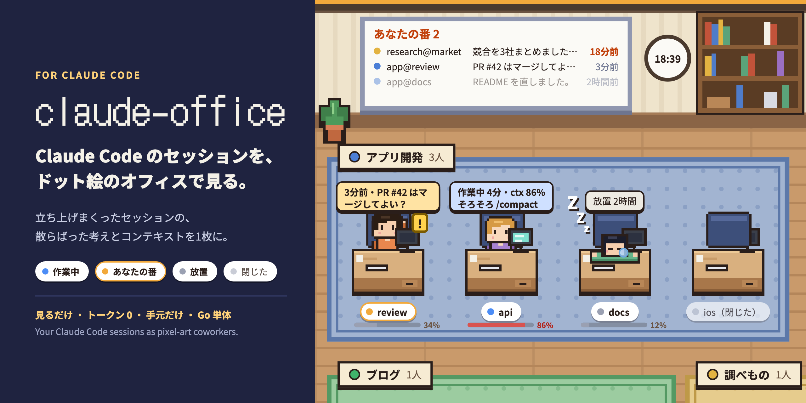
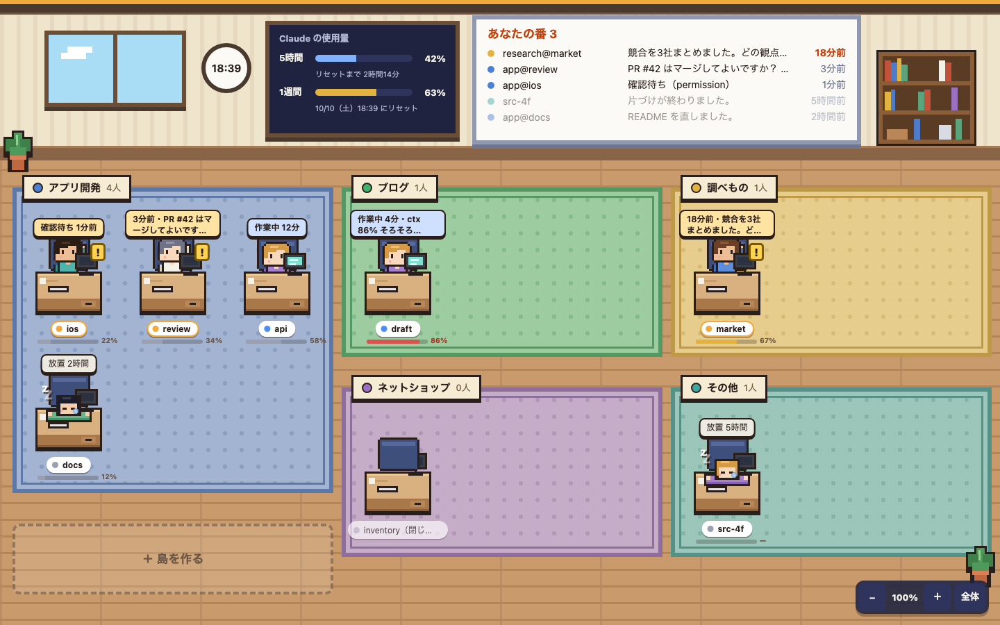

# claude-office



[English](README.md) | 日本語

Claude Code のセッションを、ドット絵のオフィスに並べて見る手元のツールです。
何本もの Claude Code セッションにそれぞれ役割を与えて、作業を分けて明確に、効率よく進めたい人向けです。席を外して戻っても、どのセッションが作業中で、どれがあなたの返事を待っているかが一目で分かります。

## なぜ作ったか

思いついたら、とりあえず `claude` を立ち上げる。気づけばタブが10本。
どのセッションが何の話をしていて、どれが自分の返事を待っていて、どれがもう重くなっているのか。**コンテキストもタスクの進み具合も、セッションの数だけ散らばっていました。** それを思い出してタブを回ること自体が、効率を落としていました。

claude-office は、散らばった状態を1枚のオフィスに並べます。

- **考えの状態が見える**：作業中・あなたの番・放置が、キャラの動きで分かる。タブを1つずつ開かずに、どこから手をつけるか決められます。
- **コンテキストの状態が見える**：セッションごとの使用率がゲージで出る。重くなる前に `/compact` や会話の切り替えができます。
- **だから、自然とトークンの節約につながる**：膨らんだコンテキストのまま作業を続けない。放置したセッションに気づいて閉じる。同じ説明を別のセッションでやり直さない。ツール自体は Claude を呼ばないので、使うトークンは0です。



- **見るだけ**：指示はこれまでどおりターミナルで出します。この画面から Claude には何も送りません。
- **トークンを使わない**：Claude は呼びません。読むのは手元のファイルだけです。
- **手元だけ**：`127.0.0.1` で待ち受けます。外へは何も送りません。
- **外部ライブラリなし**：Go の標準ライブラリだけで、実行ファイル1つです。

## できること

| | |
|---|---|
| 4つの状態 | 作業中（机でタイピング）／あなたの番（返事が来たか、許可などの確認待ち。手を挙げて跳ねる）／放置（返事から30分たった。居眠り）／閉じた（空いた椅子。1時間で消える） |
| 島 | セッション名の `@` の前（島の呼び名）で、座る島（事業やプロジェクト）が決まる。島は画面から作る・直す・消す |
| ドラッグで移す | キャラを島へドラッグすると、その島に移る `/rename` のコマンドが出てコピーできる。タブで打つまで「移り待ち」で座っている |
| ホワイトボード | 「あなたの番」の人を、待たせている長い順に。10分を超えたらオレンジ |
| カード | キャラを押すと、作業フォルダ・最後の返事の書き出し・セッション名のコピー。閉じた人なら再開のコマンド |
| コンテキスト | 名札の下に使用率のゲージ（60% で黄、80% で赤と「そろそろ /compact」） |
| 使用量 | 上の壁に、5時間・1週間の枠の使用率とリセットまでの時間 |
| その他 | 拡大縮小と「全体」（全部の島を1画面に）、ダークモードで部屋が暗くなる、ブラウザのタブに待ち人数 |

## 入れ方

**macOS・Linux**

```sh
git clone https://github.com/jose-sugisawa/claude-office.git
cd claude-office
./install.sh
```

**Windows（PowerShell）**

```powershell
git clone https://github.com/jose-sugisawa/claude-office.git
cd claude-office
.\install.ps1      # 止められたら powershell -ExecutionPolicy Bypass -File .\install.ps1
```

`install` が順にやること（途中で聞かれるのは2か所だけ。全部はいでよければ `-y`／`-Yes`）：

1. 実行ファイルを置く（`~/.local/bin/claude-office`。Windows は `%LOCALAPPDATA%\claude-office`）。Go が入っていればこのフォルダからビルドし、なければ [リリース](https://github.com/jose-sugisawa/claude-office/releases) から取ってくる
2. ログイン時に自動で起動するようにして、いま起動する（macOS は launchd、Linux は systemd --user、Windows はスタートアップフォルダ）
3. Claude Code のステータスラインに登録する（**聞かれます**。`~/.claude/settings.json` に `statusLine` を1項目足し、元の設定は `settings.json.bak` に残す。すでに別のステータスラインがあれば、置き換えるかもう一度聞く。置き換えた元のものは取っておき、uninstall で戻す。聞けないとき（パイプなど）は、`-y` が無ければ「いいえ」で進む）
4. 実行ファイルの場所が PATH に無ければ足すか聞いて、ブラウザで http://127.0.0.1:7777 を開く

外すとき：`./install.sh uninstall`（Windows は `.\install.ps1 -Uninstall`）。島の一覧などは `~/.claude/office/` に残すので、要らなければ消してください。

**ほかの入れ方**

- Go 1.23 以上があれば `go install github.com/jose-sugisawa/claude-office@latest` のあと、`claude-office install` と `claude-office statusline install`
- 自動起動を使わないなら、`claude-office` を実行しているあいだだけ開ける
- Claude Code なしで見た目だけ確かめるなら `claude-office serve -demo`
- ポートを変えるなら `CLAUDE_OFFICE_ADDR=127.0.0.1:8787 ./install.sh`

## 使い方

**係名を付けて起動する**

```sh
claude -n app@review       # 「app」の島に、名札「review」で座る
claude -n blog@draft
```

- `@` の前が島の呼び名、後ろが係名です。`app-review` のように `-` でつないでもその島に座ります。大文字小文字は区別しません。
- 名前を付け忘れたら、そのセッションで `/rename app@review` と打てば島に移ります。キャラを島へドラッグしても、そのコマンド（係名入り）が出てコピーでき、移ったら画面で知らせます。「＋ 島を作る」へ落とすと、島を作ってから移せます。
- どの島にも当てはまらない名前は「その他」に座ります。
- 名前に空白・`!`・`*`・`#` などを使うと、シェルが別の意味に取ります。`-` `_` `@` `.` と日本語は大丈夫です。

**島を作る**：島の並びの最後の「＋ 島を作る」を押し、起動コマンドの空いたところに島の呼び名（英小文字・数字・-）を打って、看板の名前と色を選びます。色はターミナルのタブ色とそろえると探しやすくなります。作った直後に出る知らせで係名を打つと、`claude -n app@review` のような起動コマンドをそのままコピーできます（続けていくつでも）。島の看板を押すと、名前と色を直したり、島を消したりできます。

**戻り方**：キャラを押して「セッション名をコピー」し、その名前のターミナルのタブを開きます（ブラウザから特定のタブへ直接は飛べません）。

## 動く環境

| | サーバー・画面 | 自動起動 | 確かめたこと |
|---|---|---|---|
| macOS | ○ | launchd | 実機で毎日使っている |
| Linux | ○ | systemd --user | CI（GitHub Actions）でテストと起動。install.sh で入れて外すところまで |
| Windows | ○ | スタートアップフォルダ | CI（GitHub Actions・PR ごと）でテストと起動。**install.ps1 と自動起動は実機で試していません** |

Claude Code 2.1.29x で確かめています。

## しくみと注意

- 動いているセッションは `~/.claude/sessions/<pid>.json`（状態・名前・作業フォルダ）から、最後の返事は会話ログ（`~/.claude/projects/*/<セッションID>.jsonl`）の末尾から読みます。**どちらも Claude Code が公開している仕様ではありません。** Claude Code の更新で読めなくなることがあります。
- コンテキストと使用量は、ステータスラインに Claude Code が渡す `context_window.used_percentage` と `rate_limits` をそのまま使います。数字が出るのは、登録のあとにそのセッションの画面が一度動いてからです。
- `CLAUDE_CONFIG_DIR` を設定していれば、`~/.claude` の代わりにそこを読みます。
- 島の書き換えと「退出させる」は、この画面（`127.0.0.1`・`localhost`・`[::1]` の同じポート）からだけ受け付けます。ほかのサイトから手元のポートへ送られた書き換えは断ります。
- 読み取りも、`127.0.0.1`・`localhost`・`[::1]` の名前で開かれたときだけ答えます（ほかのサイトが自分の名前を 127.0.0.1 に向け直して、会話の抜粋を読むのを防ぐため）。
- `-addr` は手元のアドレスだけ受け付けます。`0.0.0.0` や LAN の IP で待ち受けるには `-allow-remote` が要ります。パスワードは無いので、同じネットワークの誰でも会話の抜粋を見られます。自動起動（`install`）は手元だけです。
- 画面には会話の最後の返事の書き出しが出ます。画面を人に見せるときは気をつけてください。
- Anthropic の公式ツールではありません。

## 開発

```sh
go test ./...
go run . serve -dev .     # index.html をディスクから毎回読む（書き換えて再読み込みするだけで反映）
go run . serve -demo      # 見本のデータで
```

## 不具合・要望について

個人で使うために作ったツールなので、プルリクエストはお受けしていません。不具合や「こう動かない」は Issue でお知らせください（すぐには直せないことがあります）。改造して使いたい場合は、fork してご自由にどうぞ。

## ライセンス

MIT
